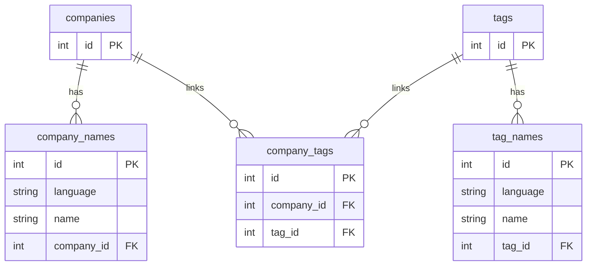

# wanted-python-assignment

FastAPI 기반의 다국어 회사/태그 검색 REST API 입니다.

## 주요 기능

-   회사명 자동 완성
-   회사 이름으로 회사 검색
-   회사 정보 등록
-   태그명으로 회사 검색
-   다국어 검색 가능
-   회사 태그 정보 추가
-   회사 태그 정보 삭제

## ERD



---

### 🐳 Docker로 실행하기

1. 환경 요구사항

-   Docker: https://www.docker.com/
-   Docker Compose
-   최신버전 설치

2. 실행 방법

```bash
# 프로젝트 루트 디렉토리에서 실행하세요
docker compose up --build
```

-   실행 시 다음 작업이 자동으로 수행됩니다:

    -   의존성 설치 (pip install)
    -   샘플 데이터 로딩 (load_sample_data.py)
    -   테스트 실행 (pytest)
    -   FastAPI 서버 실행 (http://localhost:8000)

3. API 문서보기
   FastAPI 가 제공하는 Swagger 문서로 접속할 수 있습니다.

    - http://localhost:8000/docs

4. docker 명령어 정리

    - 컨테이너 종료

    ```bash
    docker compose down
    ```

    - 캐시 무시하고 build

    ```bash
    docker compose build --no-cache
    ```

    - build 파일 실행

    ```bash
    docker compose run --rm app
    ```
